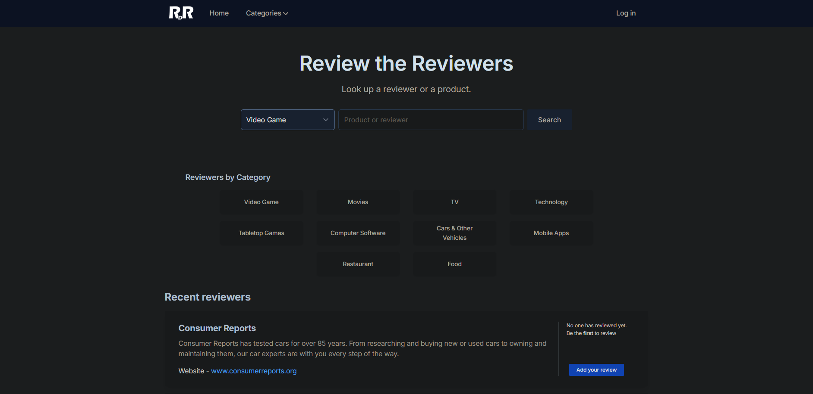
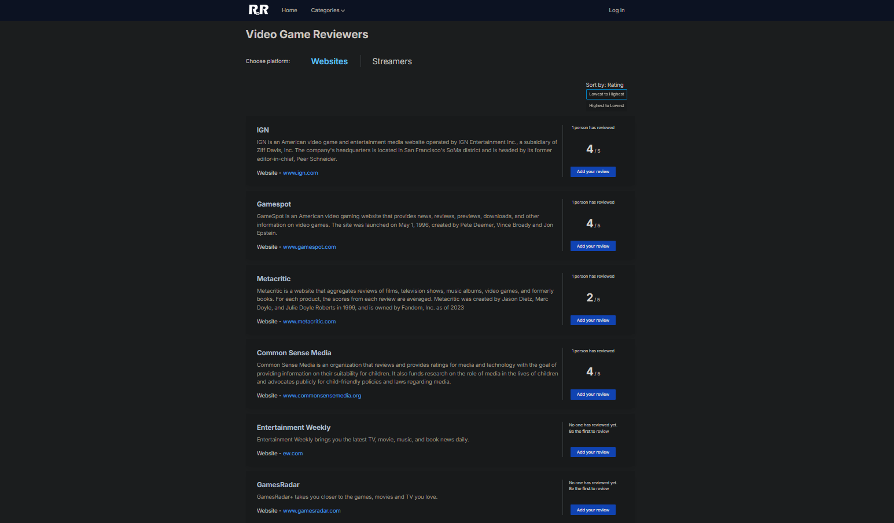
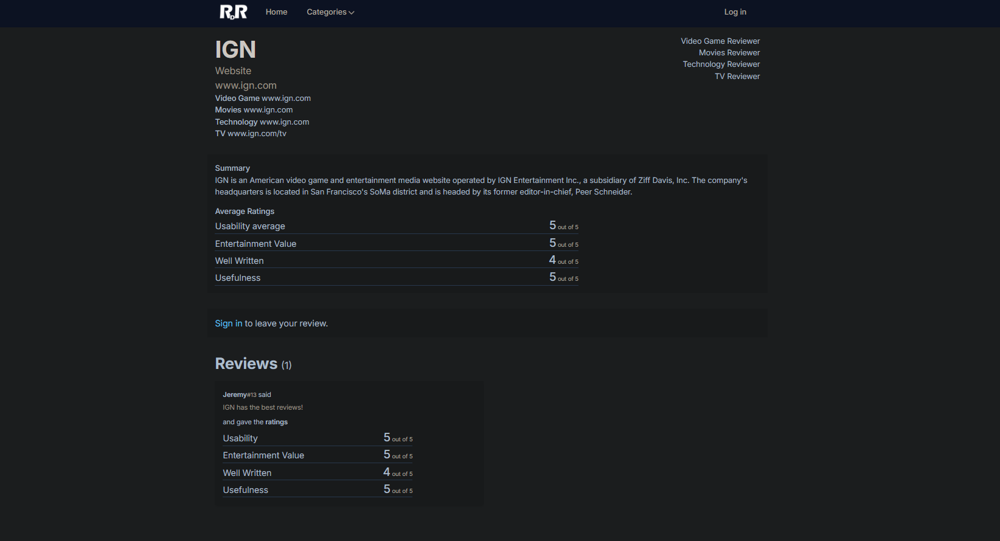

# ReviewDReviewers - Someone's got to review the reviewers too!

## 🚀 About

ReviewDReviewers allows users to review the reviewers, ensuring that you get genuine and reliable feedback!

Now you can see which reviewers are trustworthy and whose opinions truly matter.

- Easily identify the most credible reviewers and avoid misleading feedback.
- Build a community of trust where authentic reviews are rewarded.
- Engage with fellow users, share experiences, and contribute to a more transparent review ecosystem.

### 📸 Front page



### 📸 Video Game Reviewers



### 📸 Feedback for popular reviewing website, IGN



## 🔥Demo

[](https://youtu.be/Fq5W8dxCKzA)

## 📝Setup

Have Ruby 3.1.3 installed. Download from: https://rubyinstaller.org/downloads/archives/

```
ruby -v
```

Run database migrations

```
bin/rails db:migrate
```

Compile tailwind styling

```
bin/rails tailwindcss:build
```

Have Docker installed. Pull Redis docker image

```
docker pull redis
```

To use encrypted secrets, obtain the master key and store in `config/master.key`

## Start dev environment

_Note: Because Foreman is broken, we have to use 2 cmd prompts. Foreman is used to start multiple services at once. Normally Foreman is ran by running the script `bin/dev`_

In one prompt for Tailwind, run the following to watch for css changes.

```
bin/rails tailwindcss:watch
or
rake tailwindcss:watch
```

Start the Ruby on Rails server by running. Default port is 3000

```
bin/rails server
```

### Tailwind CSS

We must build our Tailwind styling into a single tailwind file to make sure we only bring in classes that are necessary.
We run the following to build the file.

```
rake tailwindcss:build
```

The built tailwind css file is `public/css/style.css`

### Redis Server

Start the redis server in Docker with the following cmd:

```
docker run --name rdr-redis -d -p 6379:6379 redis
```

The database is used to cache web pages and hash maps that store online search results consisting of review urls.
